# BogaudioModules

Modules for [VCV Rack](https://github.com/VCVRack/Rack), an open-source Eurorack-style virtual modular synthesizer:

  - [Oscillators](#oscillators)
  - [LFOs](#lfos)
  - [Filters](#filters)
  - [Envelopes and Envelope Utilities](#envelopes)
  - [Mixers, Panners and VCAs](#mixers)
  - [Effects and Dynamics](#effects)
  - [Noise/Random, Sample and Hold](#random)
  - [Sequential Switches and Sequencers](#sequencers)
  - [Visualizers](#visualizers)
  - [Polyphony Utilities](#poly)
  - [Pitch CV Utilities](#pitch)
  - [Other Utilities](#utilities)
  - [Miscellaneous](#misc)

Most Bogaudio modules support VCV Rack's polyphony feature; see <a href="#polyphony">Note on Polyphony</a>.

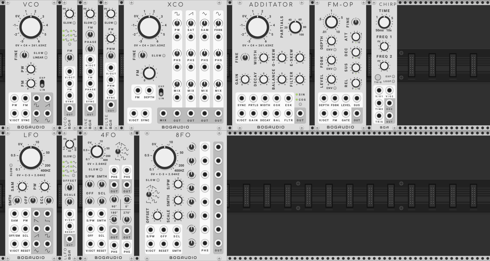


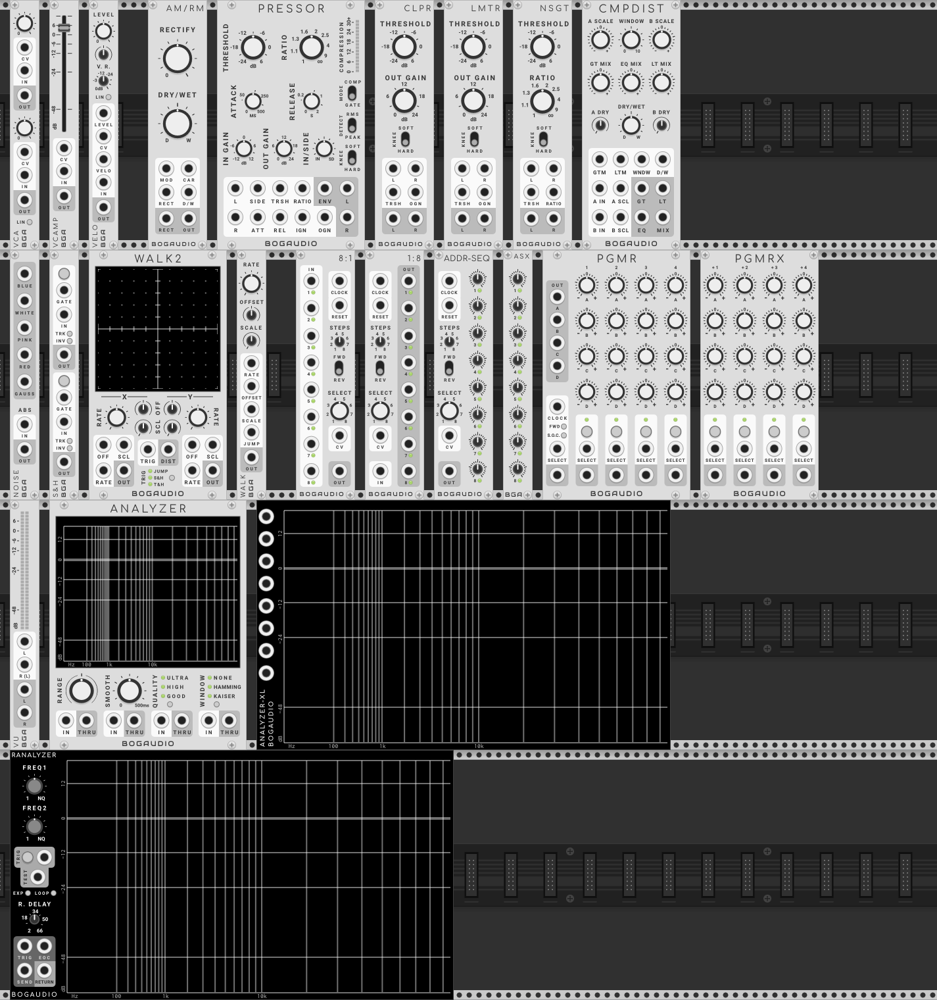


## Builds/Releases

Mac, Linux and Windows builds of the latest version are available through [Rack's Plugin Manager](https://vcvrack.com/plugins.html).  Find release notes on the [releases page](https://github.com/bogaudio/BogaudioModules/releases).


## Building

You'll need to be set up to build [VCV Rack](https://github.com/VCVRack/Rack) itself.  Under the Rack build directory, switch to `plugins/`, and then:

  ```
  git clone https://github.com/bogaudio/BogaudioModules.git
  cd BogaudioModules
  make
  ```

The master branch of this module currently builds against Rack 1.1.x.


## Modules

### <a name="oscillators"></a> Oscillators

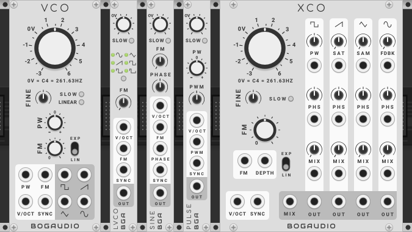

#### VCO

A standard VCO featuring:
  - Simultaneous square, saw, triangle and sine wave outputs.
  - Traditional exponential and linear through-zero FM.
  - Pulse width modulation of the square wave.
  - Hard sync.
  - Slow (LFO) mode.
  - Antialiasing by a CPU-efficient combination of band limiting and oversampling.

The main frequency knob is calibrated in volts, from -4 to +6, corresponding to notes from C0 to C6.  The default "0V" position corresponds to C4 (261.63HZ).  Any pitch CV input at the V/OCT port is added to the knob value to determine the oscillator frequency.  With CV input, the pitch can be driven as high as 95% of the Nyquist frequency (so, over 20KHZ at Rack's default sample rate).  The FINE knob allows an additional adjustment of up to +/-1 semitone (100 cents, 1/12 volt).  In slow mode, the output frequency is 7 octaves lower than in normal mode with the same knob/CV values.

In linear mode, the frequency 1000HZ times the pitch voltage (as determined by the knob plus V/OCT CV) -- at 0V, the frequency is zero, and the oscillator stops.  In slow mode, it tracks at 1HZ times the pitch voltage.  Negative voltages will realize the same output frequency as the corresponding positive voltage (the oscillator runs backwards).  Use with with an FM input to create strange waveforms.

_Polyphony:_ <a href="#polyphony">Polyphonic</a>, with channels defined by the V/OCT input.  The poly port can be changed to the FM input on the context menu.

#### LVCO

A 3HP subset of VCO, designed as a compact general-purpose oscillator.  The waveform is selectable between sine, triangle, saw, square and 25% and 10% duty-cycle pulses.  FM and linear modes are selectable on the context menu.

_Polyphony:_ Same as VCO.

#### SINE

A 3HP subset of VCO, designed in particular for use making synth drums.  The waveform defaults to sine but is selectable on the context menu, with the same options as LVCO, with the addition of a ramp (inverse saw) wave.

Additionally, there is a phase control with CV borrowed from XCO (if CV is used, the input is attenuverted by the PHASE knob).  This sets the initial position of the wave when the module is synced (if you're not using sync, changing the phase won't meaningfully alter the output).  This can be used to alter the harmonic content of sync sounds, and for transient shaping for drum synthesis.

_Polyphony:_ Same as VCO.

#### PULSE

A 3HP subset of VCO, oriented toward pulse-width modulation.  The only output waveform is square/pulse, and there is no FM.  However, the PWM CV input has a dedicated attenuverter, and unlike VCO, the result CV value is summed with the PW knob position.

_Polyphony:_ <a href="#polyphony">Polyphonic</a>, with channels defined by the V/OCT input.

#### XCO

Includes all the features of VCO, adding:
  - An onboard wave mixer with output at the MIX port.
  - For each wave type:
    - A wave modifier (pulse width for square; saturation for saw; a sample-and-hold/step-function effect for triangle; FM feedback for sine).
    - A phase knob/CV controlling the phase of the wave in the mix.
    - A mix knob/CV to control the level of the wave in the mix (waves are output at full level at their individual outputs).  The mix knob/CV responses are linear in amplitude.
  - A CV input for FM depth.

_Polyphony:_ <a href="#polyphony">Polyphonic</a>, with channels defined by the V/OCT input.

#### ADDITATOR


An additive oscillator, where the output is the sum of up to 100 individual sine/cosine waves (partials).  Various parameter knobs/CVs allow control over the number, frequencies and amplitudes of the partials:
  - PARTIALS: sets the partial count.
  - WIDTH: sets the spacing of partials in frequency; at the default position each successive partial is pitched an octave higher than the one before.
  - O-SKEW: adjusts the spacing of odd-numbered partials up or down relative to WIDTH.
  - E-SKEW: adjusts the spacing of even-numbered partials up or down relative to WIDTH.
  - GAIN: Sets the level of the output by adjusting an internal amplitude normalization parameter.
  - DECAY: applies a positive or negative tilt to the amplitude decay of the partials; at the default position, amplitudes decrease proportionally with increasing frequency.
  - BALANCE: cuts the amplitudes of the odd or even partials.
  - FILTER: manipulates the partial amplitudes to simulate low or high-pass filter effects.

_Polyphony:_ <a href="#polyphony">Polyphonic</a>, with channels defined by the V/OCT input.

#### FM-OP

A sine-wave oscillator and simple synth voice designed to allow patching up the classic FM algorithms (using multiple instances).  Features:
  - Linear through-zero FM response.
  - CV-controllable FM depth.
  - CV-controllable FM self-feedback.
  - CV-controllable output level.  The LEVEL knob and CV have a linear-in-decibels (exponential in amplitude) response; a context-menu setting makes this linear in amplitude.
  - An on-board ADSR, controlled by the GATE input, with selectable routing to output level, feedback and depth, with CV control over the sustain level.
  - A main frequency knob calibrated for setting the frequency as a ratio of the frequency dictated by the V/OCT input - assuming a single V/OCT CV is routed to multiple FM-OPs, this allows the relative frequency of each operator to be set via ratios.

_Polyphony:_ <a href="#polyphony">Polyphonic</a>, with channels defined by the V/OCT input.


### <a name="lfos"></a> LFOs

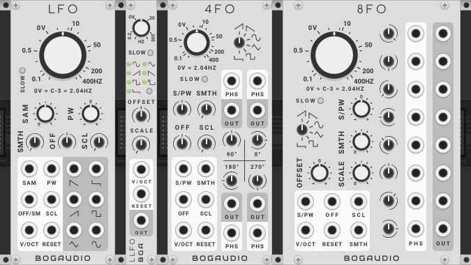

#### LFO

A standard LFO featuring:
  - Simultaneous ramp-down, ramp-up (saw), square, triangle and sine wave outputs.
  - Knob and CV control of the pulse width of the square wave.
  - A CV-controllable "sample" modifier, which turns the output into a step function.
  - Onboard CV-controllable offset and scale of the output voltages.
  - Reset (hard sync) input.
  - Slow mode.

LFO tracks pitch CVs at the V/OCT input seven octaves lower than a normal oscillator: with a 0V input, the output frequency is note C-3 (2.04HZ).  The frequency knob is calibrated in linear volts (the small ticks), and its value is added to the input V/OCT.  With no input, the frequency range is from approximately 0.1 to 400HZ; with CV the frequency may be driven up to 2000HZ or down to arbitrarily low values.  In slow mode, the output frequency tracks the controls four octaves lower than otherwise (11 octaves below a normal oscillator).

_Polyphony:_ <a href="#polyphony">Polyphonic</a>, with channels defined by the V/OCT input.

#### 8FO

An LFO with outputs at 8 different phases.  The phases may be set by knobs and CVs; by default they are 0, 45, 90, etc, degrees from the fundamental.  Otherwise, functionality is the same as with LFO, excepting that the wave shape is selectable, and all outputs are of the same (phase-shifted) wave.

_Polyphony:_ <a href="#polyphony">Polyphonic</a>, with channels defined by the V/OCT input.

#### LLFO

A 3HP LFO, with selectable waveform.  The features are a subset of LFO, with the addition of a sixth 10%-pulse waveform.

_Polyphony:_ <a href="#polyphony">Polyphonic</a>, with channels defined by the V/OCT input.


### <a name="filters"></a> Filters

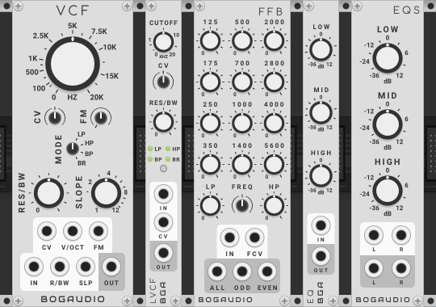

#### VCF

A general-purpose filter with a selectable lowpass, highpass, bandpass or bandreject (notch) output.  Being based on pure DSP theory, rather than a model of an analog filter design, it has a transparent character (which to say, no "character" at all, or not much -- which character is often very nice).  However, it achieves interesting features such as:
  - A slope (or transition rate at the cutoff) that can be smoothly modulated from very shallow (1 pole) to very sharp (12 poles).
  - Smoothly modulatable bandwidth in bandpass and bandreject modes.
  - Very accurate V/OCT tracking.

The large knob sets the filter's base cutoff frequency (for lowpass and highpass modes) or center frequency (for bandpass and bandreject).  There are three CV inputs that affect the cutoff; each input is converted to a HZ value and added to the base value set by the knob:
  - CV: a general, linear input expecting bipolar +/-5V signals. The input is attenuverted by the CV knob.
  - V/OCT: an input here is interpreted as a pitch CV.  Use this and set the main knob to 0HZ for accurate key tracking.
  - FM: an exponential FM input; the input here is attenuated by the FM knob, then added to the V/OCT input (which normals to 0V) before being converted to HZ.

The RES/BW knob has two functions, depending on mode:
  - In lowpass and highpass modes, it controls the resonance of the filter at the cutoff frequency.  The filter does not self-resonate.
  - In bandpass and bandreject modes, it sets the bandwidth of the filter -- the width in HZ around the center frequency of the passband (bandpass mode) or stopband (bandreject mode).  Note that at the minimum setting, the bandwidth can be quite small, even inaudible, depending on the center frequency (see below).

The R/BW CV input expects a unipolar 0-10V input; when in use this input is attenuated by the RES/BW knob.

SLOPE modulates the rate of transition between the pass and stop bands in each filter mode.  (For example, in lowpass mode, a higher slope means a faster/sharper change, at the cutoff frequency, from frequency passing through the filter to being suppressed by the filter.)  This ranges from a slow (at 1) to fast (at 12) transition.  It may be modulated by the SLP CV input, which expects 0-10V, and which is attenuated by the SLOPE knob.

The context menu option "Bandwidth mode" controls how the bandwidth is calculated for a given center frequency and RES/BW setting:
  - "Pitched" (the default): the upper and lower frequencies of the band are equally distant from the center frequency in pitch (octaves and semitones), with a maxmimum of 2 octaves.
  - "Linear": the upper and lower frequencies are equally distant in HZ from the center frequency, with a maximum of 2000HZ.

_Polyphony:_ <a href="#polyphony">Polyphonic</a>, with channels defined by the IN input.

#### LVCF

A compact version of VCF.  The filter slope may be set on the context menu.

_Polyphony:_ <a href="#polyphony">Polyphonic</a>, with channels defined by the IN input.

#### FFB

A fixed filter bank comprised of 12 bandpass filters, with low- and high-pass filters on each end.  The band frequencies are those used on the classic [Moog 914](https://modularsynthesis.com/moog/914/914.htm).

Each knobs sets the attenuation of the output of its corresponding filter, down to -60db, before those outputs are mixed back together and sent to the outputs.

The CV input (expecting 0-10V, and attenuated by the CV knob) controls a VCA that gates the outputs.

Tnere are three outputs:
  - ALL: a mix of the outputs of all the filters.
  - ODD: a mix of the LP, HP, and odd-numbered band filters (125HZ, 250 HZ, etc).
  - EVEN: a mix of the LP, HP, and even-numbered band filters (175HZ, 350 HZ, etc).

_Polyphony:_ <a href="#polyphony">Polyphonic</a>, with channels defined by the IN input.

#### EQ

A basic low/mid/high three-band equalizer.  Each knob sets the gain of its corresponding filter from -36db, through unity (0db) to +12db.

The cutoff/center frequencies of the three filters are:
  - LOW: 100Hz
  - MID: 350HZ
  - HIGH: 1000HZ

_Polyphony:_ <a href="#polyphony">Polyphonic</a>, with channels defined by the IN input.


### <a name="envelopes"></a> Envelopes and Envelope Utilities

#### DADSRH

DADSRH (Delay, Attack, Decay, Sustain, Release, Hold) is an envelope generator, augmenting a standard ADSR design with a delay stage and a self-gating (hold) mode.

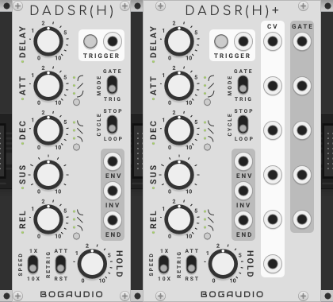

Features:
  - When the MODE switch is set to GATE, DADSRH is a more-or-less standard ADSR envelope generator, with an additional pre-attack delay stage.  The envelope is controlled by a gate CV at the trigger port, or by holding the TRIGGER button.
  - When MODE is TRIG, a trigger CV or press of the TRIGGER button will start a normal DADSR cycle, but controlled by an internal gate CV.  The internal gate persists for the time set by the HOLD knob.
  - The envelope is output as a 0-10 signal at port ENV.  Its inverse (10V - ENV) is output at INV.  When a release stage completes, a trigger is emitted at END.
  - When MODE is TRIGGER, the CYCLE switch controls whether the envelope loops or not upon completion of a release stage.
  - Toggles allow selection of linear, exponential or inverse-exponential shapes for the attack, decay and release stages.
  - The RETRIG switch controls the retrigger behavior (when a new gate or trigger happens while the envelope is running): ATT immediately attacks from the current envelope value (this is the typical behavior with many ADSRs), while RST causes a full reset of the envelope (restarting it at the delay stage).

_Polyphony:_ <a href="#polyphony">Polyphonic</a>, with channels defined by the TRIGGER input.  Pressing the trigger button will trigger all channels.

#### DADSRH+

DADSRH+ is a DADSRH, with the addition of CV inputs for each knob, and gate outputs for each stage (a stage's gate output will be high for the duration of the stage).

_Polyphony:_ <a href="#polyphony">Polyphonic</a>, with channels defined by the TRIGGER input.  Pressing the trigger button will trigger all channels.

#### SHAPER

SHAPER emulates the function of the Envelope Generator section of the classic [EMS VC3](https://en.wikipedia.org/wiki/EMS_VCS_3) and related synths.  It combines an envelope with a VCA.  Unlike an ADSR, the envelope stages are attack, on, decay and off, producing a signature trapezoidal envelope shape.


Features:
  - The ATTACK, ON, DECAY and OFF knobs specify times from nearly zero to 10 seconds.  The SPEED switch allows these times to be multiplied by 10.
  - The trapezoid envelope is output as a 0-10V control signal at port ENV, subject to attenuation by the ENV knob.  (INV outputs 10V - ENV.)
  - Audio input at port IN is sent through the internal VCA -- controlled by knob SIGNAL and the envelope -- to port OUT.  Turning up the SIGNAL knob can dramatically amplify the signal.  [This is actually a design error, but enough people have used it this way that we leave it be.]
  - A trigger CV at the TRIGGER port, or a press of the TRIGGER button, will start the envelope cycle.  When the off stage completes, a trigger is emitted at port END.  If the CYCLE switch is set to LOOP, the envelope restarts immediately.

_Polyphony:_ <a href="#polyphony">Polyphonic</a>, with channels defined by the TRIGGER input.  Pressing the trigger button will trigger all channels.

#### SHAPER+

SHAPER+ is a SHAPER, with the addition of CV inputs for each knob, and gate outputs for each stage (a stage's gate output will be high for the duration of the stage).

_Polyphony:_ <a href="#polyphony">Polyphonic</a>, with channels defined by the TRIGGER input.  Pressing the trigger button will trigger all channels.

#### AD

An AD (Attack, Decay) envelope generator in 3HP.  The attack and decay are exponentially scaled with durations up to 10 seconds.  The attack and decay times have CV inputs expecting 0-10V inputs; if a CV is present, the corresponding knob attenuates it.

When a trigger voltage is received at the TRIG input, the envelope cycle begins; whether the module will retrigger or not if a new trigger is received before the envelope cycle repeats is controlled by the RT toggle.  When the cycle completes, a trigger is emitted at EOC, and the cycle retriggers if the TRIG voltage is high.  If loop mode is enabled by the LP toggle, the envelope cycles continuously regardless of the TRIG input.

By default, the attack and decay envelope segments have an exponential curve -- in linear mode (the LIN toggle), the segments are linear.

_Polyphony:_ <a href="#polyphony">Polyphonic</a>, with channels defined by the TRIG input.

#### ASR

ASR is AR (if triggered) or ASR (Attack, Sustain, Release -- if gated) envelope generator.  It has CV inputs for the attack and release times (if CVs are used, they are attenuated by the corresponding knob values).  The sustain level may be set by the small knob marked S.  The attack and release segments have an exponential shape by default, but can be made linear with the LIN toggle.

_Polyphony:_ <a href="#polyphony">Polyphonic</a>, with channels defined by the TRIG input.

#### ADSR

A standard ADSR (Attack, Decay, Sustain, Release) envelope generator in 3HP.  The attack, decay and release knobs are exponentially scaled with durations up to 10 seconds.  The sustain knob is linearly scaled, setting the sustain level from 0 to 10 volts.  Lights below each stage knob indicate which stage is active.

By default, the attack, decay and release envelope segments have an exponential curve -- in linear mode (the LIN button), the segments are linear.

_Polyphony:_ <a href="#polyphony">Polyphonic</a>, with channels defined by the GATE input.

#### FOLLOW

An envelope follower (a utility that converts its input to a CV proportional to the level of the input's amplitude).  The DAMP knob and CV (0-10V) affect how many input samples are used to calculate the output -- higher DAMP values effectively slow down and smooth out the response.  The SCALE knob and CV (0-10V) attenutate the output.

With DAMP at the minimum setting and SCALE at half, the module is an effective wave rectifier (that is, it outputs the absolute value of the input).

_Polyphony:_ <a href="#polyphony">Polyphonic</a>, with channels defined by the IN input.

#### DGATE


A trigger-to-gate utility, with gate duration up to 10 seconds, and an optional pre-delay of up to 10 seconds.  A trigger pulse is emitted at END when a delay/gate cycle ends.  If the STOP/LOOP switch is set to LOOP, or if the trigger is high when the cycle ends, the cycle repeats.

_Polyphony:_ <a href="#polyphony">Polyphonic</a>, with channels defined by the TRIG input.  Pressing the trigger button will trigger all channels.

#### EDGE

A trigger-to-gate utility, comparator and rising/falling edge detector.  RISE and FALL set voltage levels: when the input goes above RISE, the module switches to "high" state and outputs a voltage at the HIGH output.  HOLD sets a minimum time that the module stays in the high state; this can be used to avoid jitter on the output if using high-frequency inputs.  1ms trigger pulses are output at RISE and FALL on the corresponding changes (note that if you switch the module state at audio rates, these will essentially always be high).

_Polyphony:_ <a href="#polyphony">Polyphonic</a>, with channels defined by the IN input.

### <a name="mixers"></a> Mixers, Panners and VCAs

#### MIX8

An eight-channel mixer/panner with mutes.

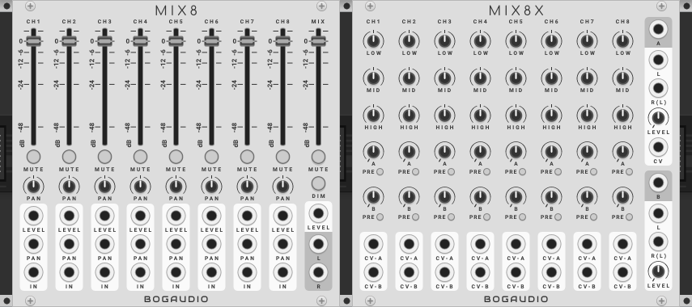

Features:
  - Eight input channels with decibel-calibrated level faders.
  - Level fader for the output mix.
  - CV control over channel and output levels; expects 0-10V CV; CV is attenuated by the corresponding slider when in use.
  - CV-controlled stereo panners; expects +/-5V CV; CV is attenuverted by the corresponding knob when in use.
  - Stereo outputs: if only one is patched, the output mix is mono.
  - Mutes per channel.
  - Right-clicking a mute buttons solos that channel (un-mutes that channel and temporarily mutes all others).  Right or left click will un-solo, restoring the old state.  Multiple channels can be "soloed" at once.
  - The fader handles contain lights indicating the signal level out of that channel.
  - The Output saturates (soft clips) at +/-12 volts.

_Polyphony:_ The module is monophonic: if a polyphonic cable is present at an input, its channels will be summed.

However, there is a non-standard polyphonic feature: on the context (right-click) menu, there are options to "spread" a polyphonic input connected to input channel 1 (only) across the mixer's inputs, as if the poly input had been split into eight mono inputs and each connected to the mixer.  This can be applied to channels 1-8 of the input, or channels 9-16.  Any input patched to an input other than input 1 will override the spread signal.

#### MIX4

A four-channel version of MIX8 with the same features.

_Polyphony:_ As with MIX8, this is a monophonic module, but with the same non-standard "spread" feature (in groups of four channels).

### MIX1

A 3HP fader/VCA, with mute.  

_Polyphony:_ <a href="#polyphony">Polyphonic</a>, with channels defined by the IN input.

#### VCM

A four-channel mixer in 10HP.


Features:
  - Four input channels and mono mix output with knob and CV control over level.  CVs expect 0-10V; when CV is in use, it is attenuated by the knob.
  - Linear mode makes the knob/CV response linear in amplitude (this is good dialing in a CV mix); otherwise, and by default, the response is linear in decibels (and therefore exponential in amplitude).

By default, the output is hard clipped at +/-12V (this is a standard in Rack).  A context menu option allows this limit to be disabled.

_Polyphony:_ <a href="#polyphony">Polyphonic</a>, with polyphonic channels defined by the first IN input.

#### MUTE8

MUTE8 provides 8 independent manual or CV-controlled mutes. Each channel is muted if its button is toggled on or if there is a positive voltage at its CV input.  Otherwise the input is passed to the output.

As with MIX4 and MIX8, a right-click on a mute button will solo that channel (pass that channel through while muting all others).  Right or left click clears this.

If context menu option "Latching CV triggers" is enabled, triggers on the CV inputs toggle muting on and off.

_Polyphony:_ <a href="#polyphony">Polyphonic</a>, where each of the 8 channels may be independently polyphonic, as defined by the cable at the channel's input.

#### PAN

A stereo panner with dual inputs channels.  Each channel's panner may be controlled with a +/-5 volt CV; when CV is in use, it is attenuverted the corresponding knob.  The output saturates (soft clips) to +/-12 volts.

_Polyphony:_ <a href="#polyphony">Polyphonic</a>, with polyphony defined by the first/top IN input.

#### XFADE

A crossfader (or two-channel mixer, or way to patch a dry/wet knob into any signal chain).  The MIX knob sets the relative strength of inputs A and B.  MIX may be controlled with a +/-5 volt CV; when CV is in use, it is attenuverted the knob.

The SHAPE knob affects the attenuation curves of the two channels as MIX changes:
  - At the center position, SHAPE at produces a standard crossfader behavior.  A and B are attenuated by half; moving MIX to A or B brings that channel to full input level while cutting the opposite channel.  The attenuation is such that if the same signal is patched to both A and B, the same signal is produced at the output regardless of the setting of MIX.
  - With SHAPE at the full counter-clockwise (left) position, there is no output when MIX is centered; moving MIX to A or B brings that channel to full level.
  - With SHAPE at full clockwise (right) position, both channels are at full (unattenuated) level when MIX is centered; moving to A or B cuts the opposite channel.

Linear mode (the LIN button) makes the level attenuation response of MIX linear in amplitude (useful when processing CV); otherwise and by default the response is linear in decibels (and therefore exponential in amplitude).

_Polyphony:_ <a href="#polyphony">Polyphonic</a>, with polyphony defined by the A input.

#### VCA

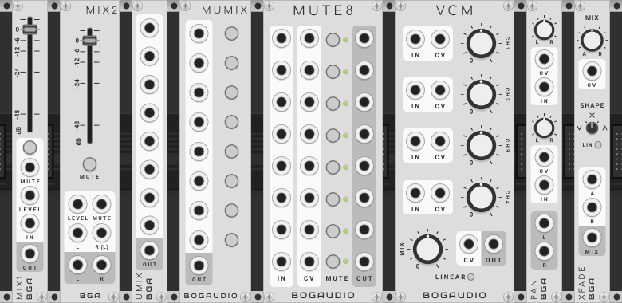

A two-channel voltage-controlled attenuator.  (An attenuator can only reduce a signal.)

Each channel's level may be controlled with a 0-10V CV; when CV is in use, it is attenuated by the corresponding knob.

In linear mode (the LIN button), the knob/CV response is linear in amplitude (useful when processing CV); otherwise and by default the response is linear in decibels (and therefore exponential in amplitude).

_Polyphony:_ <a href="#polyphony">Polyphonic</a>, with polyphony defined by the IN input, independently for the top and bottom sections of the module.

#### VCAMP

A voltage-controlled amplifier, capable of adding 12 decibels gain to the input.  (Twelve decibels gain is the same as multiplying the input by 4.)

The level may be controlled with a 0-10V CV -- when CV is in use, it is attenuated by the corresponding slider.  The slider's toggle has a light indicating the output signal level.  The output saturates (soft clips) to +/-12V.

_Polyphony:_ <a href="#polyphony">Polyphonic</a>, with polyphony defined by the IN input.

#### UMIX


A 3HP unity mixer, usable with audio or CV (e.g. to combine triggers).  Up to 8 inputs are summed to the output.  Saturation (soft clipping) limits the output to +/-12V.

The context (right-click) menu has an option to average, rather than sum, the inputs.

A second context menu option, "CV mode", disables the saturation, which allows for precise summing (or averaging) of CVs. In this case the output is hard-clipped at +/-12V.

A final context menu option allows the input gains to be reduced by up to 12db.

_Polyphony:_ <a href="#polyphony">Polyphonic</a>, with polyphonic channels defined by the first/topmost input.

#### MUMIX

Essentially identical to UMIX, but with mute buttons for each input, and with no averaging mode.

_Polyphony:_ same as UMIX.

#### MATRIX44

An 4x4 channel matrix mixer.  Each input can be routed with an independent level to each of the eight output mixes.

*Note that the matrix knobs are attenuvertors, and default to zero.*  That means there will be no output, regardless of the inputs, until some knobs are changed to non-zero values.

Saturation (soft clipping) limits each output to +/-12V.  A context menu option allows the input gains to be reduced by up to 12db.

The knobs visually indicate their values with green/orange colors.  This can be disabled on the context menu.

_Polyphony:_ <a href="#polyphony">Polyphonic</a>, with polyphonic channels defined by input 1.

#### MATRIX88

An 8x8 version of MATRIX44.

_Polyphony:_ <a href="#polyphony">Polyphonic</a>, with polyphonic channels defined by the first/topmost input.

#### SWITCH44


Identical to MATRIX44, but with switches instead of knobs.  All switches default to off, passing no signal.  A single left-click sets the switch to pass voltage with unity gain.  A second click sets the switch to pass the inverted signal.  A third click sets the switch off.

Note that you can pass attenuated values, by use of Rack's arbitrary parameter-entry feature: right-click a switch, and set its value from -100 to 100% (fractional percentages are allowed).

_Polyphony:_ <a href="#polyphony">Polyphonic</a>, with polyphonic channels defined by input 1.

#### SWITCH88

An 8x8 version of SWITCH44.

_Polyphony:_ <a href="#polyphony">Polyphonic</a>, with polyphonic channels defined by the first/topmost input.

#### SWITCH1616

An 16x16 version of SWITCH44.

_Polyphony:_ <a href="#polyphony">Polyphonic</a>, with polyphonic channels defined by input 1.


### <a name="effects"></a> Effects and Dynamics


#### AM/RM

AM/RM is a ring- and amplitude-modulation effect and CV-controllable variable wave rectifier.

  - With the default knob settings, the unit is a proper ring modulator: the MOD (modulator) and CAR (carrier) inputs are multiplied and the resulting wave is sent to the output.  MOD is passed unchanged to the RECT output.
  - As RECTIFY goes from 0 to fully clockwise, the negative portion of the MOD input is progressively folded to positive, until at the full value the wave is fully rectified.  The modified input is output at RECT; the modified input is multiplied with the carrier input and sent to the output.
  - The DRY/WET control mixes the otuput of the mod/carrier multiplication with the unmodified carrier input.

The RECT inputs expects a bipolar (+/-5V) CV, which is added to the RECTIFY knob.  The D/W input works the same for the DRY/WET knob.

Note: AM/RM is calibrated to expect +/-5V, 10V peak-to-peak signals (i.e. the output of a typical oscillator).  A modulator signal with a negative value in excess of -5V will be affected by the rectifier circuit even if the RECTIFY is zero.  To avoid this effect, you may need to attenuate a hot signal you wish to use as the modulator.

_Polyphony:_ <a href="#polyphony">Polyphonic</a>, with polyphony defined by the CAR input.  The polyphony input can be switched to MOD on the context menu.

#### <a name="pressor"></a> PRESSOR

PRESSOR is a stereo [compressor](https://en.wikipedia.org/wiki/Dynamic_range_compression) and [noise gate](https://en.wikipedia.org/wiki/Noise_gate) with many controls and a sidechain input.  A compressor attenuates signals louder than a threshold level; a noise gate attenuates signals quieter than a threshold level.

The module's signal path has two main components: a detector, and the compressor/gate.  The detector -- effectively an envelope follower -- analyzes the inputs (including the sidechain input, if in use), producing a control signal which is used to control the compressor/gate.  The detector signal is also emitted at ENV.

The various controls and ports work as follows:
  - The MODE switch sets whether the module works as a compressor (COMP) or noise gate (GATE).
  - THRESHOLD sets the threshold in decibels.  The default 0dB setting corresponds to the 10V peak-to-peak output level of a standard oscillator.  The TRSH input expects a unipolar (+10V) input; if in use this is attenuated by the knob.
  - RATIO sets the degree of attenuation applied to a signal.  In compressor mode, higher settings attenuate the signal more as the detector output goes above the threshold; at the maximum setting, the compressor becomes a limiter.  In noise gate mode, higher ratios more completely attenuate inputs below the threshold.  The RATIO CV input is unipolar (0-10V), attenuated by the knob
  - The COMPRESSION meter provides a visual indication of the amount of attenuation being applied to the input at any given moment, and is proportional to the CV output at ENV.
  - ATACK and DECAY control lag times in the the movement of the detector signal as the input changes.  Each has a corresponding unipolar (+10V) CV attenuated by the corresponding knob.
  - The DECTECT switch toggles the detector between RMS and peak level analyzers; RMS averages the input over a short window whereas PEAK uses the instantaneous level.
  - KNEE toggles between a slightly softer or harder response as the attenuation turns on or off as the signal crosses the threshold.
  - IN GAIN attenuates (up to -12db) or amplifies (up to +12db) the left and right inputs.  (It does not apply to the sidechain input.)  The modified input is sent to the detector and the compressor/gate.  The IGN CV input expects a bipolar (+/-5V) signal which is added to the knob position.
  - OUT GAIN applies up to 24db of amplification to the left and right outputs, after the compressor/gate circuit does its work.  The outputs are subject to saturation (soft limiting at +/-12V).  The OGN CV input expects a bipolar (+/-5V) signal which is added to the knob position.
  - IN/SIDE controls the input to the detector, as a mix/crossfade between the left/right inputs (which are processed by IN GAIN, then summed), and the sidechain input.

Several of the settings can take fairly extreme values (e.g. OUT GAIN); this allows the module to be used as a distortion effect.

_Polyphony:_ <a href="#polyphony">Polyphonic</a>, with polyphony defined by the L input.

#### CLPR

CLPR is a compact (6HP) [clipper](https://en.wikipedia.org/wiki/Clipping_%28audio%29).  Its controls behave the same as the corresponding controls on PRESSOR.

In contrast to LMTR, CLPR chops a signal at a voltage threshold corresponding to the selected amplitude, significantly distorting the signal.

_Polyphony:_ <a href="#polyphony">Polyphonic</a>, with polyphony defined by the L input.

#### LMTR

LMTR is a compact (6HP) [limiter](https://en.wikipedia.org/wiki/Dynamic_range_compression).  Its controls behave the same as the corresponding controls on PRESSOR.

In contrast to CLPR, LMTR does not distort the signal very much; it just reduces the amplitude of the signal to keep it below the threshold.

_Polyphony:_ <a href="#polyphony">Polyphonic</a>, with polyphony defined by the L input.

#### NSGT

NSGT is a compact (6HP) [noise gate](https://en.wikipedia.org/wiki/Noise_gate).  Its controls behave the same as the corresponding controls on PRESSOR.

_Polyphony:_ <a href="#polyphony">Polyphonic</a>, with polyphony defined by the L input.


### <a name="random"></a> Noise/Random, Sample and Hold


#### NOISE

A noise source, in types blue (f), white, pink (1/f), red (aka brown, 1/f^2) and Gauss (normal with mean 0 and variance 1).

Additionally, NOISE has an absolute value circuit.  Patch audio into ABS to get positive CV.  For example, patch white noise into ABS to get uniform values in the range 0-10V.

_Polyphony:_ For the noise outputs, the number of polyphonic channels is set on the context (right-click) menu.  Independently, the ABS circuit is <a href="#polyphony">polyphonic</a>, with polyphony defined by the IN input.

#### S&H

A dual sample-and-hold and trigger-and-hold.  Sampling may be triggered by CV (on the rising edge of a trigger or gate) or button press.

If nothing is connected to an IN port, sampling for that channel is normalled to an internal white noise source with range 0-10V. Alternative options for the normal source noise type and range are available on the context (right-click) menu.  The normal source selection applies to both channels.

Each channel can be independently toggled into track-and-hold mode with the corresponding TRK button.  In this mode, when the input at GATE is high, or the button is held, the input is copied to the output.  When the gate goes low, the input is sampled and held until the next gate.

Each channel may also be have its output inverted with the INV button.

The GATE input on the lower section is normalled to GATE in the top section (but a press on the top button does not trigger the lower section).

_Polyphony:_ <a href="#polyphony">Polyphonic</a>, with polyphony defined by the GATE input, independently on the top and bottom sections of the module.  The polyphony port can be changed to IN on the context menu (this applies to both top and bottom sections of the module).

#### WALK2

WALK2 provides two channels of chaotic output, where the output voltage moves as a random walk.  The two outputs are drawn as a trace, in X and Y, on the display.

For each channel:
 - RATE (knob and cv) controls how sedately, or wildly, the CV moves around.  If CV is in use, it is attenuated by the knob.
 - OFFSET (knob and cv) adds or subtracts up to 5V from the base +/-5V output.  If the offset CV is in use, it is attenuverted by the knob.
 - SCALE (knob and cv) attenuates the output; if CV is in use, it is attenuated by the knob.

Additionally:
  - A trigger on the JUMP input will cause both channels to jump to a random value.  A bit of slew limitation applies to the jump to minimize popping.
  - DIST outputs a third CV, ranging over 0-10V, derived from X and Y channel outputs.  

Clicking on the display will jump the outputs, X and Y, to that point (again with a bit of slew limitation).

Various options on the context (right-click) menu allow customization of the display (set the range of the display to +/-10V instead of the default +/-5V; hide the grid dots; set the color of the trace).

_Polyphony:_ The module is monophonic (note that WALK is polyphonic).

#### WALK

WALK is a single-channel random walk, identical to one channel of WALK2, in 3HP.

_Polyphony:_ <a href="#polyphony">Polyphonic</a>, with polyphony defined by the RATE input.  The polyphony port can be changed to OFFSET, SCALE or JUMP on the context menu.


### <a name="sequencers"></a> Sequential Switches and Sequencers

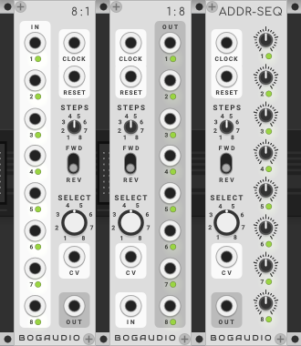

#### 8:1

8:1 is a sequential switch and voltage-addressed switch (multiplexer) at once -- it routes 8 inputs to 1 output according to either a clock or CV input (or both).

As a sequential switch, a trigger at the clock input advances the input selection -- which input is routed to the output.  Like a sequencer, it can be reset with a trigger at RESET; the number of inputs to cycle through may be set with the STEPS knob; and the direction is set with the FWD/REV switch.

As a multiplexer, it routes an input to the output under control of the SELECT knob and CV.  A 0-10V CV, divided into 8 equal divisions of 1.25V, controls the input selection.  A CV of less than 1.25V does nothing; a voltage of 1.25-2.49V will add 1 step to the selection, and so on.  This value is summed with the knob setting; for example, setting the knob to 4 and inputting a 2.6V CV will send input 6 to the output.  When the knob-plus-CV value exceeds 8, it wraps around.

Both functions may be used simultaneously: the SELECT+CV value is added to the sequential/clocked value, wrapping around.  Note that the STEPS value only affects the sequential value; for example, using a clock input and setting STEPS to 2 will yield an alternation between two adjacent inputs, but this pair can be selected with the SELECT knob or CV.

On the context (right-click) menu, if option "Select on clock mode" is selected, then the select value (knob and CV) is checked and used to modify the active step only when a clock is received, rather than continuously.

Also on the context menu, option "Triggered select mode" changes how the SELECT feature works, replacing the continuous voltage selection with a second internal sequence that offsets (adds to) the primary sequential switch step.  In this mode, the SELECT input exepcts trigger pulses, which advance the secondary sequence, while the SELECT knob sets the length of the secondary sequence (and a trigger at RESET will reset it). Thus different clocks and step lengths can be used to create complex output step patterns. "Select on clock mode" has no effect if "Triggered select mode" is enabled.

_Polyphony:_ <a href="#polyphony">Polyphonic</a>, with polyphony defined by the CLOCK input.  This can be set to the SELECT CV input on the context menu.

#### 1:8

1:8 is the opposite of 8:1 -- it routes a single input to 1 of 8 outputs.  The control circuit behavior (CLOCK, SELECT, etc) is the same.

_Polyphony:_ Same as 8:1.

#### ADDR-SEQ

ADDR-SEQ is an 8-step sequencer where the step values are set by 8 knobs (with default output range of +/-10V).  It has the same clocked or voltage-addressed control circuit as 8:1 and 1:8.

The output range of the knobs may be set on the context (right-click) menu to a variety of bipolar (e.g. +/-5V) and unipolar ranges (e.g. 0-5V).

_Polyphony:_ Same as 8:1.


### <a name="visualizers"></a> Visualizers

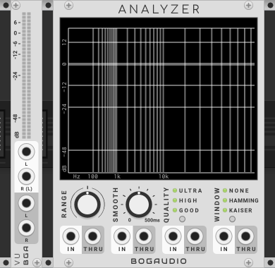

#### ANALYZER

A four-channel spectrum analyzer.

Features:
  - Range setting: smoothly scrolls the displayed frequency range, from just the lower 10% at full counter-clockwise, to the entire range (up to half the sampling rate) at noon, to the upper 20% at full clockwise.
  - Smooth setting: controls how many analysis frames will be averaged to drive the display.  A higher setting reduces jitter, at the expense of time lag.  For convenience, the knob setting is time-valued, from zero to half a second (internally this is converted to an integer averaging factor based on the sample rate and other settings).
  - Quality setting: changes the FFT window size.  Higher settings yield finer frequency resolution, at a higher CPU cost.  The levels and sizes are: GOOD (1024 samples), HIGH (2048 samples) and ULTRA (4096 samples).  If Rack's sample rate is 96khz or higher, the sizes are doubled.
  - Window setting: sets the window function applied to the input to the FFT.  The options are Kaiser, Hamming and none/square.  The default, Kaiser, is probably best for most purposes.
  - Each channel has a THRU output, which passes the corresponding input through unchanged.
  - On the context (right-click) menu, the display vertical (amplitude) range can be set to extend down to -120dB (the default is -60dB).

_Polyphony:_ Monophonic, with two exceptions:
  - If an input is polyphonic, its channels are summed, and the spectra of the summed signal is displayed.
  - A polyphonic input is copied unchanged (channels intact) to THRU.

#### ANALYZER-XL

An eight-channel, 42HP version of ANALYZER, with edge-to-edge-screen design.  Options corresponding to ANALYZER's panel controls are available on the context (right-click) menu.

_Polyphony:_ Monophonic, but if an input is polyphonic, its channels are summed, and the spectra of the summed signal is displayed.

#### VU

A stereo signal level visualizer/meter.  The L channel is sent to both displays if if nothing is patched to R.  Inputs to L and R are copied to the L and R outputs.

_Polyphony:_ Monophonic, but if an input is polyphonic, its channels are summed, and summed value is used to compute the level displayed (independently for the left and right inputs).


### <a name="poly"></a> Polyphony Utilities


#### MONO

MONO mixes down the channels of a polyphonic cable to a single-channel mono output.  It is an alternative to the SUM module that comes with VCV Rack, but adds a basic onboard compressor, to even out the level differences when only a few, or many, channels on the input are sounding.  The COMP control sets the amount of compression; at zero there is no effect and the behavior of this module is essentially equivalent to Rack's SUM.  As with SUM, the LEVEL control simply attenuates the output.  The output, post-LEVEL, is saturated (soft-clipped) at +/-12V.

#### ARP

ARP is a performance-oriented arpeggiator, where the arpeggiated notes come from polyphonic pitch and gate inputs.  It is designed to patched directly to Rack's MIDI-CV (with polyphony enabled) and be played with a MIDI keyboard.  As below, it can be controlled by other modules as well, though this needs to be done carefully.

When a gate goes high on a poly channel of the GATE input, the pitch of the corresponding poly channel from the V/OCT input is added as a note to the arpeggio. (Thus, if ARP is patched to MIDI-CV, pressing a key on your MIDI controller adds a note to the arpeggio.)

The arpeggio is played back under control of the input at CLOCK, which is required for the module to do anything, at the rate of one note per clock pulse.

MODE controls how the arpeggio plays back:
  - UP: play the current notes in ascending pitch order.
  - DN (down): play the notes in descending pitch order.
  - PD (pendulum): play the notes up, then down, without repeating the minimum and maximum notes.
  - PR (pendulum repeat): play the notes up, then down, repeating the min and max notes.
  - IO (in order): play the notes in the order they were played into the module.
  - RD (random): play random notes from the arpeggio; notes may repeat.
  - SH (shuffle): on each arpeggio, play each note once, but in random order.  Repeated notes may still occur, but only when the last note of a sequence happens to be the same as the randomly-selected first note of the next sequence.

The GATE knob sets the output gate length for each played note, as a proportion of the time between the last two clock pulses (which can potentially cause odd behaviors if you use an irregular clock).  The minimum gate pulse is 1ms; if the knob is turned all the way up, the gate does not drop between notes.

HOLD latches the arpeggio, such that it keeps playing even when all input gates are low.  Once all gates are low, a new gate will start adding notes to a new arpeggio.  Notes will be added to the current arpeggio as long as any gate is high.

A trigger at the RESET input will reset the playback of the current arpeggio on the next received clock.  

By default, new notes recorded by the module are incorporated into the playing arpeggio only when the arpeggio restarts on its first note.  On the context (right click) menu, the "Use new notes" setting can be changed such that notes have immediate effect.  

The outputs are always monophonic -- patch ARP into ASSIGN to play an arpeggio through a poly voice.

**To control ARP from modules other than MIDI-CV**, you'll at minimum need to create a polyphonic pitch signal (with Rack's MERGE or something else) and connect it to V/OCT.  Then you'll need gates:
  - With a monophonic gate input, whenever the gate goes high, the pitches of the arpeggio will be set per the poly channels on the V/OCT input, reading in order from channel 1.  So if the gate goes high while V/OCT is getting a four-channel poly input with voltages corresponding to C3, E3, G3 and B3, the arpeggio will be set to those four notes.
  - With a polyphonic gate input, the effect is like pressing a key on a MIDI controller to trigger a gate on a poly channel.  ARP will see a new note using the pitch of the corresponding poly channel on V/OCT.  *You will get strange results if the V/OCT and GATE inputs have a different number of poly channels.*

Note that the HOLD toggle and "Use new notes" menu setting still apply however you control ARP.  If not playing from a keyboard, it will usually make sense to toggle HOLD on and set "Use new notes" to "Immediately".  

#### ASSIGN

ASSIGN is a mono-to-poly voice assigner and poly-to-poly voice reassigner (where the in and out channel counts may be different).  Mono vs poly operation is defined the poly channel count on the GATE input.

One use of the module is to play a (monophonic) sequence through a polyphonic voice, such that envelope tails may ring out.

With mono inputs, on each gate received at GATE, the current pitch at V/OCT is assigned to a poly channel at the V/OCT output, and a gate is output on the same channel at the GATE output.  (The output gate will drop when the input gate does.)  Voices are assigned by increasing channel number, up to the number of channels set by the CHAN knob, at which point channels are reused in order starting with channel 1.  A trigger at the RESET input resets the next assignment to channel 1.

With polyphonic inputs, when a gate goes high on an input channel, the gate and corresponding pitch are assigned to an output channel.  Up to the number of channels defined by the CHAN knob may be output at once.  The module attempts to reuse free channels; if none are free the oldest assignment is replaced.

#### UNISON

UNISON allows for unison-mode play of a polyphonic voice, where monophonic pitch and gate inputs are copied out to multiple polyphonic channels, as set by the CHAN knob.

DETUNE allows detuning the pitches sent out to the poly channels up to half a semitone (50 cents).  DETUNE may take a CV, which if present is attenuated by the knob position.

The behavior of DETUNE depends on the number of output channels:
  - With one channel, the unaltered input pitch is sent to the one output channel.
  - With two channels, one channel is tuned up by the full detune amount, while the other is tuned down the full amount.
  - With three channels, one channel gets the input pitch, while the other two are tuned up and down the full detune amount.
  - With four channels, a channel gets each of: up and down the full amount and up and down half the amount.
  - And so on, such that the detune amounts are evenly spread, and one channel gets the unaltered pitch if and only if the channel count is odd.

#### POLYCON

POLYCON allows fixed voltages to be sent directly to some number of polyphonic channels by channel number.  The number of output channels is set the CHAN knob, unless an input is present at the CHAN input, in which case the channel count is taken from that input, and the knob is ignored.  

This can be used to introduce a bit fixed variation across the channels of a poly voice.

#### POLYMULT

POLYMULT will turn a mono signal into a polyphonic signal, with a given number of channels, where each channel gets a copy of the input voltage.  The number of channels is set by the CHAN knob, unless an input is present at the CHAN input, in which case the channel count is taken from that input, and the knob is ignored.  Each OUT output is identical.

To simply make copies of an already-polyphonic signal, use the regular <a href="#mult">MULT</a> module.


### <a name="pitch"></a> Pitch CV Utilities

Utilities related to processing pitch CVs (1 volt / octave CVs, for controlling the pitch of oscillators).

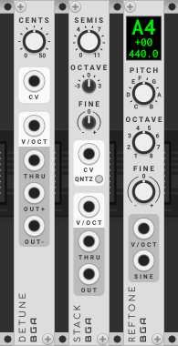

#### DETUNE

A 1V/octave pitch processor, for controlling a detuned oscillator pair.  A reference pitch in raised and lowered by the number of cents (hundredths of a semitone) specified by the knob and CV, and emitted at OUT+ and OUT-.  The input pitch is emitted at THRU.

_Polyphony:_ <a href="#polyphony">Polyphonic</a>, with polyphony defined by the V/OCT input.

#### STACK

A 1V/octave pitch processor for stacking oscillators.  The SEMIS, OCTAVE and FINE knobs determine an interval (up or down) to apply to the input pitch and send to OUT.  The input pitch is sent unmodified to THRU, for ease of chaining multiple STACKs to control multiple oscillators, e.g. to create chords.

The CV input expects +/-5V; the value modifies the interval set by the knobs in the amount of one semitone per tenth volt.  If QZ (quantize) is active, the CV-controlled interval is quantized to the nearest semitone.  This specialized CV is output at the THRU port, with a value set by the knobs and CV in, when there is no input pitch.

_Polyphony:_ <a href="#polyphony">Polyphonic</a>, with polyphony defined by the V/OCT input.

#### REFTONE

A tuner that outputs a selectable (Western, chromatic) pitch as CV (1V/octave, for controlling an oscillator) or as a pure sine tone.  The base pitch is selected with the PITCH and OCTAVE knobs, while the FINE knob allows the output to be fine-tuned up or down a full semitone.  The LED-style display indicates the selected pitch, octave and fine tuning (in cents), and the corresponding frequency (in hertz).

_Polyphony:_ Monophonic.


### <a name="utilities"></a> Utilities


#### BOOL

A boolean logic utility.  Inputs are considered true if the input voltage is greater than 1V.  The top section takes two inputs and computes AND, OR and XOR at the outputs.  The lower section computes the negation of its input.  Output is 5V if an output is true, 0V otherwise.

_Polyphony:_ <a href="#polyphony">Polyphonic</a>, with polyphony defined by the first/topmost input. The NOT circuit is independently polyphonic based on its input.

#### CMP

CMP is window comparator utility.  It takes two inputs, A and B, which normal to 0V.  Each is summed with the value of its corresponding offset knob and clipped to +/-12V.  The four outputs indicate the relative values of A and B:

 - A>=B will output high if A is greater than or exactly equal to B.
 - A<B will output high if A is less than B.
 - EQ will output high if the difference between A and B are less than or equal to the window voltage.
 - NOT will output high if EQ is low.

The WINDOW knob specifies the window voltage.  LAG specifies a time of up to one second by which a change in the output will lag a change in the inputs states; if the input state switches back before the lag expires, the output does not change. WINDOW and LAG each take a unipolar (0-10V) voltage, each of which is attenuated by the corresponding knob.

The OUTPUT switch sets the high and low voltage values for the outputs: 0V low/+10V high, or -5V low/+5V high.

_Polyphony:_ <a href="#polyphony">Polyphonic</a>, with polyphony defined by the A input.

#### CVD

A simple delay designed for use with CV (though it works fine with audio).  Use it to delay triggers or gates, create a flip-flop that resets itself after a time, make a sequence run for a while then stop, to double up an envelope, or what have you.

The large TIME knob sets the delay time, as scaled by the small knob (up to 0.1, 1 or 10 seconds); TIME takes a 0-10V CV, attenuated by the knob.  Reducing time truncates the internal delay buffer.  The DRY/WET knob sets the mix of the original and delayed signals at the output, with a +/-5V CV input.

_Polyphony:_ <a href="#polyphony">Polyphonic</a>, with polyphony defined by the IN input.

#### FLIPFLOP

A boolean memory utility with two independent channels.  A high voltage at TRIGGER will cause the state of a channel to change from A to B.  A subsequent trigger will flip it back.  Output is 5V at whichever of A and B is selected, 0V at the other.  A trigger voltage at RESET sets the channel back to state A.

_Polyphony:_ <a href="#polyphony">Polyphonic</a>, with polyphony defined by the channels at the TRIG input, independently for the two sections of the module.

#### MANUAL

A manual trigger/gate with 8 outputs.  A constant high value is sent from each output for as long as the TRIG button is held.  

Manual may be set to output a trigger pulse (+5V for 10ms) on patch load (akin to a Max/Msp loadbang).  This is off by default; enable clicking "Trigger on Load" on the module's context (right-click) menu.  The pulse is emitted 100ms after the patch starts processing samples.

_Polyphony:_ Monophonic.

#### <a name="mult"></a> MULT

A 3 HP multiple (signal splitter or duplicator).  There are two 1-to-3 channels.  There is also a 1-to-6 mode: if nothing is patched to the second channel's input, the input to the first channel is copied to all six outputs.

_Polyphony:_ Polyphonic inputs are duplicated (channels intact) at their corresponding outputs.

#### OFFSET

An offset and scaler.  The OFFSET and SCALE knobs have CV inputs.  With an input signal, output is `(input + offset) * scale`.  With no input connected, the output is constant in the value of `offset * scale`.

By default, the output is capped at +/-12 volts (this is a standard in Rack).  A context menu option allows this limit to be disabled.

_Polyphony:_ <a href="#polyphony">Polyphonic</a>, with polyphony defined by the channels of IN input.

#### SLEW

A slew limiter - when the input changes rapidly, the output changes less rapidly, lagging the input.

The rising and falling slew rates and shapes are set independently.  The RISE and FALL time knobs are calibrated to set the time the output would need to catch up to a 10V change in the input.

The RISE and FALL shape knobs affect the movement of the output as it catches up to the input (the shape it would draw on a scope). The shapes vary between log, linear and exponential curves.

_Polyphony:_ <a href="#polyphony">Polyphonic</a>, with polyphony defined by the channels of the IN input.

#### SUMS

An arithmetic logic utility.  The top section outputs the sum, difference, maximum and minimum of its input signals (unpatched inputs send a 0V signal into each computation).  The lower section negates (reverses the sign of) its input.

By default, the output is capped at +/-12 volts (this is a standard in Rack).  A context menu option allows this limit to be disabled.

_Polyphony:_ <a href="#polyphony">Polyphonic</a>, with polyphony defined by the first/topmost input.  The NEG circuit is independently polyphonic based on its input.

#### SWITCH

A signal-routing module with two through channels.  If the button is held or the GATE input is high, the HIGH input for each channel is routed to the corresponding OUT.  Otherwise, each LOW input is routed to each OUT.

If LTCH (latch) mode is enabled, a button click or trigger pulse at GATE will toggle the output to HIGH; a second click or trigger resets it to LOW.

_Polyphony:_ If polyphonic input is present at GATE, then the module is polyphonic in the standard way, independently switching the independent polyphonic channels on the high/low inputs (the button will switch all channels).  Additionally, if the input at GATE is not present or monophonic, but polyphonic cables are are present at any high/low inputs, and such an input is switched to the output, it is duplicated to the output with channels intact.


### <a name="misc"></a> Miscellaneous


#### BLANK3

A 3HP blank panel.

#### BLANK6

A 6HP blank panel.


## <a name="polyphony"></a> Note on Polyphony

Most modules in this collection support VCV Rack's polyphony feature according to Rack's <a href="https://vcvrack.com/manual/VoltageStandards.html#polyphony">polyphony standards</a>.

Generally this means that a module with polyphonic support can run up to 16 independent internal "channels".  The number of channels a module will run is defined by the polyphony of the signal (cable) present at a particular, designated input port.  (This will be the pitch input of an oscillator, or the gate input of an envelope, and so on.)  When the input at that port carries more than one channel, the module's outputs will carry the same number of channels.

With secondary inputs (CV inputs), the behavior is usually:
  - If the input signal is monophonic, that single value is used by each channel in the module.
  - If the input is signal is polyphonic, each processing channel will use the value of the corresponding channel of the CV input.  If the CV input does not have as many channels as the module is processing, higher channels will see a zero input from the CV.

Knobs, faders and switches apply equally to all modules channels.  Where a module has indicator lights, these usually display an average value across the active module channels.  (This indicator behavior isn't specified by the standard.)

A few modules are strictly monophonic.  In this case, a polyphonic input will be handled in one of two ways:
  - The polyphonic channels will be summed (typically if the input is designed for audio).
  - The value of the first channel will be used, ignoring others (typically if the input is designed for CV).

See the documentation for each module for notes on any divergence from these basic rules.  Each module's documentation will also indicate which input port defines the module's polyphony.

Other notes:
  - With some modules, it's not obvious which input should define the module's polyphony -- but it is always the case that the channels will be taken from just one input.  For example, with stereo modules with left and right inputs, the left input defines the polyphony of the module.  With mixers like UMIX and MATRIX88, the first input is used.  With some modules, the input to use can be set on the context (right-click) menu.  Each module's documentation will describe which port or optional ports are used for polyphony.
  - Modules with no inputs may still support polyphonic outputs; in this case the polyphony is set on the context (right-click) menu.  NOISE is an example.
  - Some modules are not polyphonic in a strict sense, but have non-standard polyphonic features (see the channel spread feature on MIX4 and MIX8).

Finally, please note that with the addition of polyphony, the term "channels" can have several meanings in this documentation.  Polyphonic modules have up to 16 internal processing "channels", defined by the polyphonic "channels" of their inputs, and carrying over to the polyphonic "channels" of their outputs.  But, elsewhere, MIX8 is an "8-channel" mixer; stereo modules will have left and right "channels"; VCA is a dual module with two independent "channels" (each of which may be polyphonic); ANALYZER has four input "channels" (in that it will display the spectra of four different inputs simultaneously); and so on.


## Other Notes

#### <a name="resumeloop"></a> Loop Behavior on Patch Load

Modules Shaper, Shaper+, DADSRH, DADSHR+ and DGATE can each be set to loop.  These modules will automatically being running (looping) when the patch loads if they were looping when the patch was saved.

This behavior can be disabled on a per-module basis by right-clicking the module and unchecking "Resume Loop on Load".


## Issues and Feedback

Bug reports and feedback are welcome: please use the [issue tracker](https://github.com/bogaudio/BogaudioModules/issues).


## Acknowledgements

Uses [FFTReal](https://github.com/cyrilcode/fft-real) under the DWTFYWT Public License.
